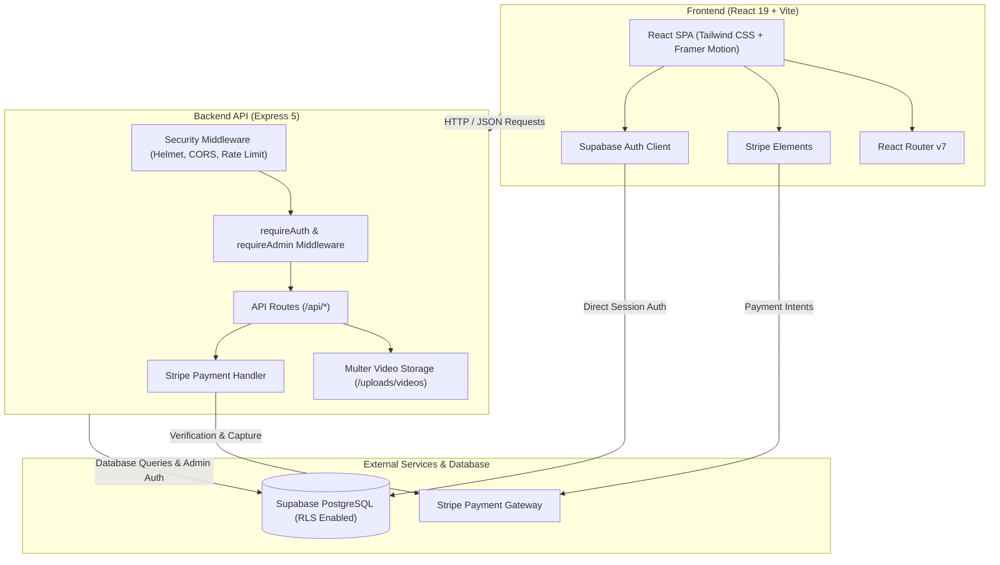

# AlMajd Air Platform

A modern, full-stack HVAC and air systems service management platform built with React 19, Node.js/Express, Supabase (PostgreSQL), and Stripe. The platform connects customers with HVAC maintenance, repair, and installation services, providing video diagnosis uploads, real-time booking, automated payments, technician dispatch, and an administrative analytics dashboard.

---

## Table of Contents

- [Features](#features)
- [Tech Stack](#tech-stack)
- [Architecture](#architecture)
- [Project Structure](#project-structure)
- [Installation & Setup](#installation--setup)
- [License](#license)
- [Author](#author)

---

## Features

### Customer Portal
- **Service & Brand Catalog**: Interactive browsing of supported air conditioning and HVAC brands, system models, and tailored service options.
- **Online Booking & Diagnostics**: Appointment scheduling with support for uploading diagnosis videos (up to 100 MB via Multer) directly to assist technicians prior to dispatch.
- **Secure Stripe Checkout**: Integrated payment processing using Stripe Elements (`@stripe/react-stripe-js`).
- **User Authentication**: Email/password authentication, session management, and password reset flows powered by Supabase Auth.
- **Customer Profiles**: Order tracking, booking history, and personal profile management.

### Technician Workspace
- **Assigned Job Management**: Real-time view of service appointments, customer addresses, reported faults, and uploaded diagnostic media.
- **Job Status Updates**: Workflow status tracking (Pending, In Progress, Completed).

### Admin Dashboard
- **Analytics & Revenue Reporting**: Visualized performance and booking trends powered by [Recharts](https://recharts.org/).
- **Role-Based Access Control**: Multi-tier permissions distinguishing between `customer`, `technician`, and `admin` roles.
- **Catalog & Booking Oversight**: Manage brand records, service offerings, and incoming customer reservations.

---

## Tech Stack

### Frontend (`/client`)
- **Core**: React 19 (`^19.2.7`), JavaScript (ES modules), Vite 5 (`^5.4.11`)
- **Routing**: React Router DOM 7 (`^7.18.1`)
- **Styling**: Tailwind CSS (`^3.4.17`), PostCSS, Autoprefixer
- **UI Components & Motion**: Lucide React (`^1.23.0`), Framer Motion (`^12.42.2`)
- **Charts & Data Visualization**: Recharts (`^3.10.0`)
- **Payments**: `@stripe/react-stripe-js` (`^6.8.0`), `@stripe/stripe-js` (`^9.12.0`)
- **Database Client**: `@supabase/supabase-js` (`^2.110.1`)

### Backend (`/server`)
- **Runtime & Server**: Node.js, Express 5 (`^5.2.1`)
- **Database Client**: `@supabase/supabase-js` (`^2.110.2`)
- **Payment Processing**: Stripe SDK (`^22.3.2`)
- **File & Media Handling**: Multer (`^2.2.0`) with disk storage for diagnostic video uploads
- **Security & Protection**: Helmet (`^8.3.0`), Express Rate Limit (`^8.6.2`), CORS (`^2.8.6`)
- **Email Service**: Nodemailer (`^9.0.3`)

### Database (`/database`)
- **Engine**: Supabase (PostgreSQL)
- **Security**: PostgreSQL Row Level Security (RLS) policies (`apply_rls.sql`)

---

## Architecture



---

## Project Structure

```text
AlMajd-Air-Platform/
├── client/
│   ├── public/              # Static assets and icons
│   ├── src/
│   │   ├── assets/          # Component images and static media
│   │   ├── components/      # Reusable UI components
│   │   ├── context/         # Auth and state management context
│   │   ├── layouts/         # Layout shells and navigation headers/footers
│   │   ├── lib/             # Utility helpers
│   │   ├── pages/           # Application views (Home, AdminDashboard, TechnicianPage, etc.)
│   │   ├── App.jsx          # Root application routing definition
│   │   ├── index.css        # Tailwind CSS imports
│   │   ├── main.jsx         # Vite DOM entry point
│   │   └── supabaseClient.js# Supabase client instantiation
│   ├── package.json         # Client dependencies and Vite scripts
│   ├── tailwind.config.js   # Tailwind CSS design system configuration
│   └── vite.config.js       # Vite bundler configuration
├── server/
│   ├── uploads/videos/      # Stored diagnostic video uploads
│   ├── index.js             # Express application, routes, and middleware
│   └── package.json         # Server dependencies and scripts
├── database/
│   ├── apply_rls.sql        # Supabase Row Level Security configuration script
│   ├── index.js             # Database client connection module
│   └── package.json         # Database package metadata
└── test-backend.js          # Backend health/test utility script
```

---

## Installation & Setup

### Prerequisites

- [Node.js](https://nodejs.org/) (v18.x or higher)
- [npm](https://www.npmjs.com/)
- A [Supabase](https://supabase.com/) project (PostgreSQL URL and API keys)
- A [Stripe](https://stripe.com/) account (Publishable and Secret keys)

### Environment Configuration

1. **Server Environment (`server/.env`)**:
   ```env
   PORT=5000
   SUPABASE_URL=https://your-supabase-project.supabase.co
   SUPABASE_SERVICE_ROLE_KEY=your_supabase_service_role_key
   STRIPE_SECRET_KEY=sk_test_...
   FRONTEND_URL=http://localhost:5173
   ```

2. **Client Environment (`client/.env`)**:
   ```env
   VITE_SUPABASE_URL=https://your-supabase-project.supabase.co
   VITE_SUPABASE_ANON_KEY=your_supabase_anon_key
   VITE_STRIPE_PUBLISHABLE_KEY=pk_test_...
   VITE_API_URL=http://localhost:5000
   ```

### Running the Application

1. **Install and start the Backend Server**:
   ```bash
   cd server
   npm install
   node index.js
   ```
   The backend API will listen on `http://localhost:5000`.

2. **Install and start the Frontend Client**:
   ```bash
   cd ../client
   npm install
   npm run dev
   ```
   The Vite dev server will start (default: `http://localhost:5173`).

---

## License

ISC License (as specified in package configuration).

---

## Author

- **Mohamed Ghanem** - [Eng-Ghanem](https://github.com/Eng-Ghanem)
